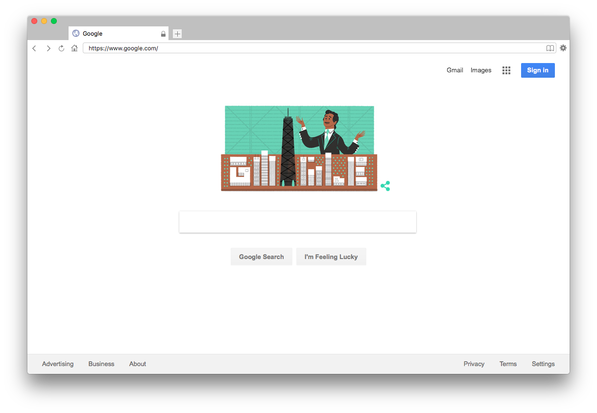
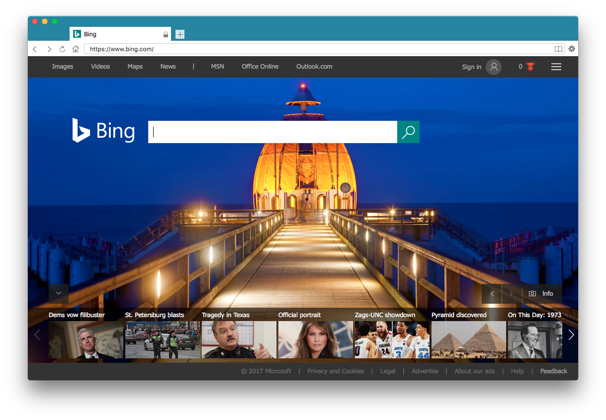
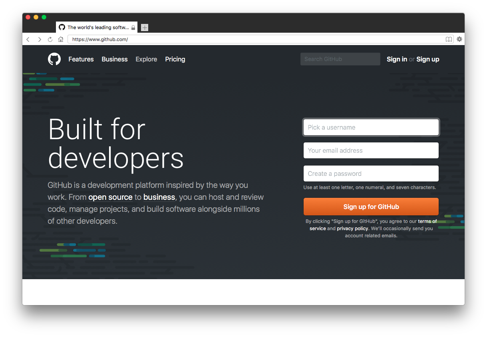

[](https://github.com/insleep/spark-web-browser/ "Spark - a minimal web browser for macOS")

[](https://github.com/insleep/spark-web-browser/releases/) [](https://travis-ci.org/insleep/spark-web-browser) [](https://developer.apple.com/library/mac/documentation/Cocoa/Conceptual/ProgrammingWithObjectiveC/Introduction/Introduction.html)

## About

Spark is a simple, lightweight browser for Windows and macOS built with the [WebKit](https://webkit.org) browser engine.

Although being lightweight and easy-to-use, Spark is fast and powerful, and can load webpages in *seconds*.

Spark for macOS is compatible with macOS 10.11 El Capitan and later. Earlier versions of macOS might work, but are not supported.

## Screenshots





## Install

Installation is easy. Click [here](https://github.com/insleep/spark-web-browser/releases/) to download the latest version of Spark for macOS.

## Custom Builds

In order to build Spark for macOS, you need to have Xcode 7 and git 1.7 or later. Earlier versions might work, but are not supported.

Git is downloadable [here](https://git-scm.com/downloads) and Xcode is downloadable within the Mac App Store.

#### Instructions:

Clone a copy of the main Spark for macOS git repo by running:

```bash
git clone git://github.com/insleep/spark-web-browser.git
```

Open `Spark.xcodeproj`, located in the `SparkWebBrowser` directory of Spark for macOS.

Make any necessary changes and compile Spark within Xcode.

The compiled version of Spark will be put in the `build/` subdirectory, along with other required files.

## Known Issues
There are no known issues at the moment.

### [Looking for Spark for Windows? Click here.](https://github.com/insleep/SparkWebBrowser-Windows/)

## [License](https://github.com/insleep/spark-web-browser/blob/master/LICENSE)
